<div align="center">

<a href="https://www.dailydoseofplay.com"></a>

# Daily Dose of Play

**Game night, any time.** Free classic board games for 2 to 4 players, in the browser.

[**Play now**](https://www.dailydoseofplay.com) ·
[Games](#games) ·
[Run it locally](#play-locally) ·
[Add a game](#add-a-game-in-five-steps) ·
[Report a bug](https://github.com/Faezehyas/dailydoseofplay/issues/new?labels=bug)

[](https://github.com/Faezehyas/dailydoseofplay/actions/workflows/test.yml)
[](LICENSE)
[](CONTRIBUTING.md)

<a href="https://www.dailydoseofplay.com">
  <picture>
    <source media="(prefers-color-scheme: dark)" srcset="docs/images/home-dark.png">
    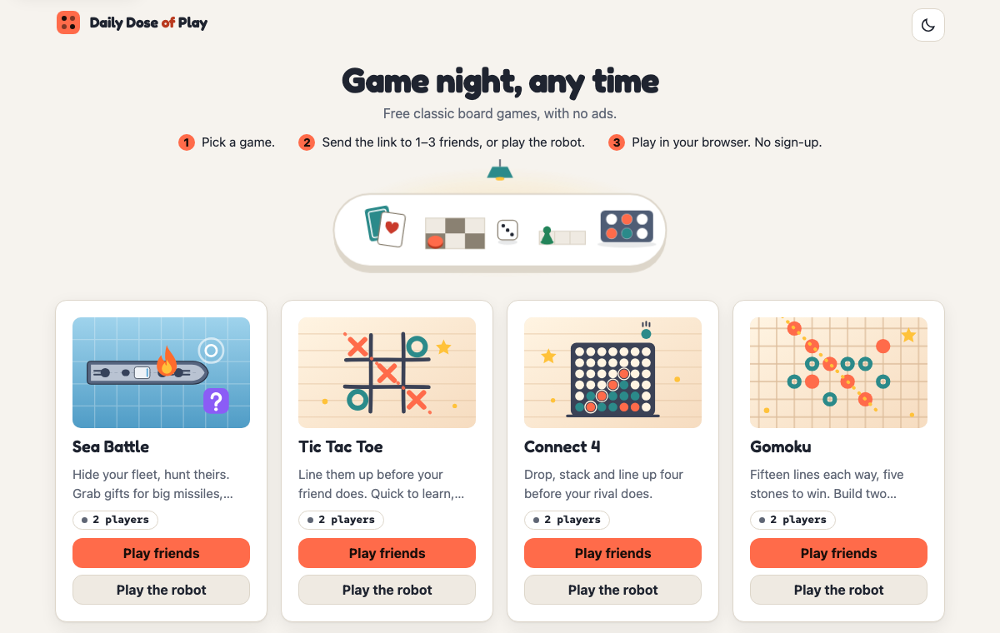
  </picture>
</a>

</div>

No sign-up, no ads and nothing to install: send a link to friends or play the
robot. Once everyone is in, the game runs browser to browser; the server only
introduces the players.

## Games

<table>
<tr>
<td width="50%" valign="top">
<a href="https://www.dailydoseofplay.com/sea-battle/">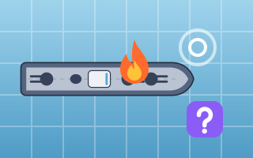</a><br>
<b><a href="https://www.dailydoseofplay.com/sea-battle/">Sea Battle</a></b> · 2 players<br>
Battleship rules, with gifts and special weapons; optional shot and game clocks.
</td>
<td width="50%" valign="top">
<a href="https://www.dailydoseofplay.com/tic-tac-toe/">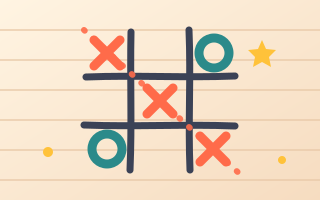</a><br>
<b><a href="https://www.dailydoseofplay.com/tic-tac-toe/">Tic Tac Toe</a></b> · 2 players<br>
3×3 with three in a row, or 5×5 with four in a row; optional move and game clocks.
</td>
</tr>
<tr>
<td width="50%" valign="top">
<a href="https://www.dailydoseofplay.com/connect-4/">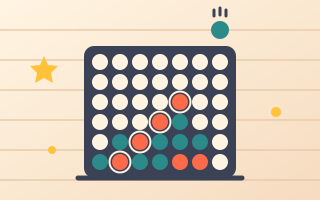</a><br>
<b><a href="https://www.dailydoseofplay.com/connect-4/">Connect 4</a></b> · 2 players<br>
Drop discs and line up four, on a 7×6 board or bigger; optional clocks; an Easy, Medium or Hard robot.
</td>
<td width="50%" valign="top">
<a href="https://www.dailydoseofplay.com/gomoku/">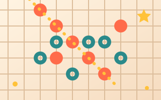</a><br>
<b><a href="https://www.dailydoseofplay.com/gomoku/">Gomoku</a></b> · 2 players<br>
Five in a row on a 15×15 board; optional move and game clocks.
</td>
</tr>
<tr>
<td width="50%" valign="top">
<a href="https://www.dailydoseofplay.com/chess/">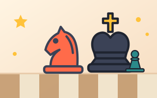</a><br>
<b><a href="https://www.dailydoseofplay.com/chess/">Chess</a></b> · 2 players<br>
Standard rules with castling, en passant and promotion; optional clocks; a robot with three levels.
</td>
<td width="50%" valign="top">
<a href="https://www.dailydoseofplay.com/checkers/">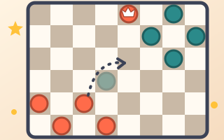</a><br>
<b><a href="https://www.dailydoseofplay.com/checkers/">Checkers</a></b> · 2 players<br>
English draughts on 8×8, with forced captures, multi-jumps and kings; optional clocks; an Easy, Medium or Hard robot.
</td>
</tr>
<tr>
<td width="50%" valign="top">
<a href="https://www.dailydoseofplay.com/backgammon/">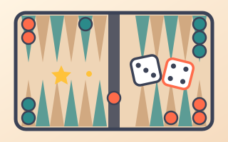</a><br>
<b><a href="https://www.dailydoseofplay.com/backgammon/">Backgammon</a></b> · 2 players<br>
Race fifteen checkers home and bear them off; shared dice, optional turn and game clocks, a robot at three levels.
</td>
<td width="50%" valign="top">
<a href="https://www.dailydoseofplay.com/chutes-and-ladders/">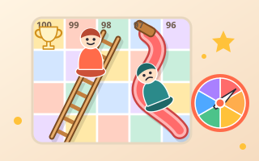</a><br>
<b><a href="https://www.dailydoseofplay.com/chutes-and-ladders/">Chutes and Ladders</a></b> · 2–4 players<br>
The classic 100-square board with a 1–6 spinner, for 2 to 4 players; climb the ladders, slide down the chutes; house rules for the finish and for a 6.
</td>
</tr>
<tr>
<td width="50%" valign="top">
<a href="https://www.dailydoseofplay.com/dots-and-boxes/">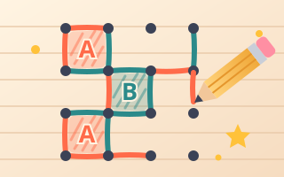</a><br>
<b><a href="https://www.dailydoseofplay.com/dots-and-boxes/">Dots and Boxes</a></b> · 2 players<br>
Join the dots on a 3×3 to 6×6 board; closing a box earns another line; optional clocks; an Easy, Medium or Hard robot that plays the chains properly.
</td>
<td width="50%" valign="top">
<a href="https://www.dailydoseofplay.com/ludo/">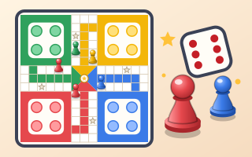</a><br>
<b><a href="https://www.dailydoseofplay.com/ludo/">Ludo</a></b> · 2–4 players<br>
The classic cross-shaped board for 2 to 4 players; roll a 6 to come out, send rivals back to their yard, and race four tokens home; house rules for three 6s, blocks and capture bonuses, play on for places, a move timer, and 1–3 robots at three levels.
</td>
</tr>
<tr>
<td width="50%" valign="top">
<a href="https://www.dailydoseofplay.com/crazy-eights/">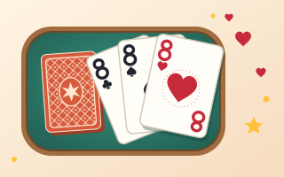</a><br>
<b><a href="https://www.dailydoseofplay.com/crazy-eights/">Crazy Eights</a></b> · 2–4 players<br>
The classic card game with a 52-card deck; match the suit or the rank, play an 8 to name a suit, and empty your hand first. Nobody deals and nobody can see another hand: every browser shuffles with a proof, and the game is audited when it ends. Room settings for drawing, optional action cards (2, queen, ace), who starts and a move timer; 1–3 robots at three levels; a four-colour deck.
</td>
<td width="50%" valign="top">
<a href="https://www.dailydoseofplay.com/go-fish/">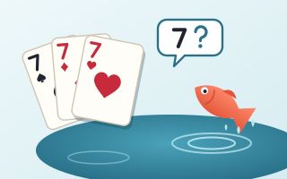</a><br>
<b><a href="https://www.dailydoseofplay.com/go-fish/">Go Fish</a></b> · 2–4 players<br>
Ask for a rank, catch a lucky fish, and lay down the most books of four. Hidden hands with no dealer, as in Crazy Eights: cards change hands face up, and the audit at the end catches anyone who said "Go fish" while holding the rank. Room settings for the deal, the lucky fish, an empty hand, pairs for young players, who starts and a time to ask; 1–3 robots at three levels; a four-colour deck.
</td>
</tr>
<tr>
<td width="50%" valign="top">
<a href="https://www.dailydoseofplay.com/gin-rummy/">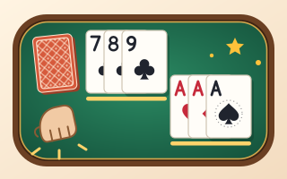</a><br>
<b><a href="https://www.dailydoseofplay.com/gin-rummy/">Gin Rummy</a></b> · 2 players<br>
Classic two-player gin: draw, discard, build sets and runs, then knock with 10 or less or go gin; lay-offs, undercuts, and a game to 100 with its bonuses. Your hand groups itself into its melds, and you can drag it into any order. No dealer and no peeking, as in the other card games; a knock shows the hand, so every score is checked as it happens. Room settings for one hand a game, Oklahoma knocking, Big Gin, who deals first and a move timer; a robot at three levels; a four-colour deck.
</td>
<td width="50%" valign="top">
</td>
</tr>
</table>

More are coming; [GAMES.md](GAMES.md) has the backlog. Found a security
problem? Report it privately, as [SECURITY.md](SECURITY.md) describes.

## Play locally

You need Node 22 or newer.

```bash
git clone https://github.com/Faezehyas/dailydoseofplay.git
cd dailydoseofplay
npm install
npm start                 # http://localhost:8080  (PORT=3000 npm start to change)
```

- Each game lives at `/<slug>/`, e.g. http://localhost:8080/ludo/. The slugs are in [public/games.json](public/games.json).
- Shortcuts: `/<game>/?robot=1` starts a robot game; `/<game>/?friend=1` creates a room for friends at once (the home page's **Play friends**); `/<game>/?room=CODE&key=KEY` (the invite link) joins a room. Without `key`, the room's host has to let you in.
- Health: http://localhost:8080/healthz

To play a friend match on one machine, open the game in two windows (one
private), click **Play with a friend** in one, and open the invite link in
the other. Two devices on the same Wi-Fi work too: open
`http://<your-computer's-LAN-IP>:8080`.

<details>
<summary>Server options: allowed origins and the client address header</summary>

The lobby socket (`/ws`) only accepts pages served by this server (whatever
address you opened it at) or by the live site. To let pages from another
origin connect, for example a preview deployment, list them in
`ALLOWED_ORIGINS`: `ALLOWED_ORIGINS=https://preview.example npm start`.
Details in [ARCHITECTURE.md](ARCHITECTURE.md#server).

Wrong room codes are rate limited per client address (5 a minute). The
address is the first one in `X-Forwarded-For`, else the socket's; set
`CLIENT_IP_HEADER` to read another header, e.g. `CLIENT_IP_HEADER=X-Real-IP npm start`.

</details>

### Run with Anybuild

[Anybuild](https://github.com/wasmerio/anybuild) finds the Node app on its
own, runs `npm install` and starts the server. Install it with
`curl -fsSL https://anybuild.run/install | sh`.

```bash
anybuild plan .                       # what it found: Node 24, npm, node server/server.js
anybuild . --start                    # http://localhost:8080  (PORT=3000 anybuild . --start to change)
anybuild . --start --runner=wasmer    # the same inside Wasmer's runtime, as in production
```

- `--start` runs the server with the Node you have installed.
- `--runner=wasmer` needs the [Wasmer CLI](https://docs.wasmer.io/install). No sign-in is needed.
- Anybuild writes an `Anybuild` file you can edit and a `.anybuild/` folder. Git ignores both: a committed `Anybuild` file could change how Wasmer builds the live site.

Tested with Anybuild 0.33.0 and Wasmer 7.5.0.

## Add a game in five steps

A game is one folder in `public/` plus one line in `public/games.json`. You
don't touch the server.

1. **Claim it.** Pick an open game from "Up next" in [GAMES.md](GAMES.md), or suggest a new one, and open a [Game proposal](https://github.com/Faezehyas/dailydoseofplay/issues/new?template=game-proposal.yml) issue. Once a maintainer labels it `accepted` and assigns you, open a draft PR within a week, or the claim lapses. This way two people don't build the same game.
2. **Copy the closest game.** Most games have no hidden information and use the shared turn engine: start from Tic Tac Toe or Connect 4, or from Ludo or Chutes and Ladders for dice and up to 4 players. Hidden cards or ships follow Sea Battle.
3. **Write the rules and their tests.** `rules.js` is pure: no page, network or timers, and an illegal move throws. Cover it in `rules.test.js`.
4. **Build the view and the robot.** `main.js` draws the board, `robot.js` picks moves, `icon.svg` is the home page card. Use your own names, art and text.
5. **Open a PR.** Work on a branch such as `feat/<slug>` and open a draft PR titled `feat: add <Name>` early. Run the tests, then mark it ready for review. One game per PR.

[CONTRIBUTING.md](CONTRIBUTING.md) has the full recipe and the checklist.
[ARCHITECTURE.md](ARCHITECTURE.md) explains how rooms, WebRTC and fair play
work.

## How PRs are reviewed

- **The checklist.** Reviewers go through the checklist at the end of [CONTRIBUTING.md](CONTRIBUTING.md#checklist-before-opening-the-pr): pure, tested rules; a robot that finishes its games; a friend match with rematch; no hidden information on the wire; 360 px wide in light and dark; original art and text; no new dependencies and no server changes.
- **CI.** Every PR runs `npm test`, a dependency audit and the browser tests in Chromium ([.github/workflows/test.yml](.github/workflows/test.yml)). They must pass.
- **Timing.** A review usually comes within a few days. Once the PR is merged, the game goes live on the site.

## Tests

```bash
npm test                  # unit (rules, robot, fair play, protocol) + server/signaling integration
npm run test:browser      # headless Chromium: friend matches with rematch, robot games, failure screen
```

The browser test needs Playwright (`npm i -g playwright && npx playwright
install chromium`). It skips itself when Playwright is not found. Screenshots
go to `test-artifacts/`.

## Project layout

```
server/            Node server: static files, /ws signaling, /healthz
public/
  index.html       home page (cards from games.json)
  games.json       game registry
  engine/          shared browser engine: lobby, signaling client, WebRTC, sessions, fair play, card decks, UI shell
  <slug>/          one folder per game: page, rules, robot, view, sounds, tests
  privacy/         privacy page
test/              integration and browser tests
docs/              deploying
vendor/            the mental-poker library behind card decks (git submodule), our patches and lock file
scripts/           build-mental-poker.sh builds it into public/engine/vendor/mental-poker/ (committed); install-wasm-tools.sh gets the pinned tools for CI
app.yaml           Wasmer Edge app config (name dailydoseofplay, owner faezeh_yass)
```

## Known limitations

- **No relay (TURN) server.** Wasmer Edge has no UDP, so some network pairs can't connect directly (strict NAT, some mobile carriers or VPNs). The game says so and offers a retry or the robot.
- **Rooms live in server memory.** The app is pinned to one region to keep rooms on one set of instances. A friend's join could still in theory land on a different instance.
- **Fair play is checked after the game, not refereed live.** A modified client could lie during play; the lie is detected at the end, and stalling or leaving is not prevented.
- **A modified host browser can read a hand in card games with three or more players.** Every message passes through the room creator's browser, which could hold back a player's moves, forge a game-ending move in their name and so get their key for the audit while the real game goes on. With two players the host is your only opponent, so this gives them nothing. See "A modified host" in [ARCHITECTURE.md](ARCHITECTURE.md#card-games-cardmatch).

## Credits and license

- Made by [Faezeh Yass](https://github.com/Faezehyas). Chutes and Ladders, Dots and Boxes, Ludo and rooms for up to 4 players came from [M.Amin Rayej](https://github.com/maminrayej).
- The gameplay and flow follow papergames.io; names, art, text and code are original.

Thanks to everyone who has helped:

<a href="https://github.com/Faezehyas/dailydoseofplay/graphs/contributors"></a>

The code and the original art (game icons and boards) are under the
[MIT License](LICENSE). Two kinds of files keep their own terms:

- **Recorded sounds** are third-party CC0 recordings, credited in each game's `sounds/LICENSE.txt`.
- **Fonts** are under the SIL Open Font License, see `public/engine/fonts/LICENSE.txt`.

## Deploying

The owner's Wasmer Edge setup and the site's domains are in [docs/deploy.md](docs/deploy.md).
